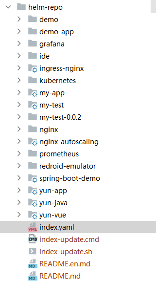

# Git仓库托管chart


## 环境准备

* [x] 开通git仓库
* [x] 安装helm客户端


## 步骤

* 创建你的仓库文件夹，例如helm-repo，并设置好git地址

<figure><figcaption></figcaption></figure>

* 在helm-repo文件夹下执行，helm create xxxx，添加到git
* 创建index-update脚本，windows下为cmd；linux下为.sh


```powershell
echo "开始准备更新..."
helm repo index ../helm-repo
echo "更新完成"
```



```sh
#!/usr/bin/env bash
echo "开始准备更新...";
helm repo index ../helm-repo
echo "更新完成!"
```


* 右键执行这个cmd文件，执行成功后会生成一个名字为index.yaml的chart索引文件。不需修改直接推送到远程git仓库。


```yaml
#helm repo index --url https://gitee.com/gpg-dev/helm-charts.git .
#https://gitee.com/gpg-dev/helm-charts
apiVersion: v1
entries:
  my-test:
    - apiVersion: v2
      appVersion: 1.16.0
      created: "2019-12-07T17:55:16.095749+08:00"
      description: A Helm chart for Kubernetes
      digest: 5909523dffde5b12f3c589bcea2d31a5785aa437dc8ea6ed147fcbf57b13a671
      name: my-test
      type: application
      urls:
        #- https://helloworlde.github.io/helm-chart/helloworld-0.1.0.tgz
        - https://gitee.com/gpg-dev/helm-charts/my-test-0.0.2.tgz
      version: 0.0.1
generated: "2019-12-07T17:55:16.092676+08:00"
```


* 找到这个index.yaml文件所在路径，截取文件路径：[https://gitee.com/gpg-dev/helm-repo/blob/master/](https://gitee.com/gpg-dev/helm-repo/blob/master/)

<figure><figcaption></figcaption></figure>

* 本地/目标主机执行，如下命令即可完成helm 仓库添加，并使用helm repo update同步更新索引

<pre class="language-powershell"><code class="lang-powershell">helm repo add gitee 
<strong>https://gitee.com/gpg-dev/helm-repo/blob/master/
</strong></code></pre>

